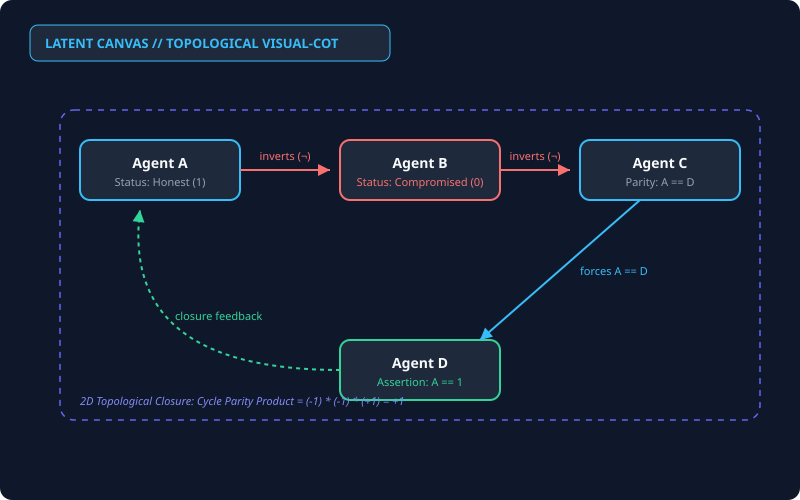

# Latent Canvas

[](https://github.com/Jin1Gine2Elmonte/latent-canvas1/actions)
[](https://www.python.org/downloads/)
[](https://opensource.org/licenses/MIT)
[](#)
[](https://github.com/googleapis/python-genai)

> **Visual Chain-of-Thought (Visual-CoT) Developer Framework & Multimodal Verification Harness.**  
> Moving Large Language Models beyond 1D sequential token streams into 2D topological causal spaces via dynamic SVG synthesis, in-memory rasterization, and multimodal visual self-critique.

<p align="center">
  
</p>

---

## Mission Statement
Traditional autoregressive models reason along a **one-dimensional, left-to-right token trajectory**. In complex causal deduction, cyclic state machines, circular parity paradoxes, and multi-agent coordination problems, this linear inductive bias suffers from:
1. **Attention Drift & Recency Blindness**: Earlier premises become diluted as tokens accumulate.
2. **Cycle Concealment**: Circular dependencies ($A \implies B \implies C \implies \neg A$) become obscured in verbose natural prose.
3. **Premature Commitment**: Autoregressive decoding commits to an early false deduction branch without backtracking.

**Latent Canvas** introduces **Visual Chain-of-Thought (Visual-CoT)**: an architecture where the model projects its intermediate reasoning space into a **2D topological graph rendered as raw SVG**. That vector diagram is rasterized in-memory into PNG bytes and looped back into the multimodal visual encoder. The model visually audits its own conceptual layout—detecting feedback loops, bottlenecks, and invalid transitions through genuine 2D spatial attention before emitting the final verified resolution.

---

## Quickstart

### 1. Installation
```bash
git clone https://github.com/Jin1Gine2Elmonte/latent-canvas1.git
cd latent-canvas1
pip install -e .
```

### 2. Instant Offline Demo (Zero Setup)

Test the harness immediately without configuring an API key:

```bash
latent-canvas run --demo
```

### 3. Run Live Multimodal Reasoning

```bash
export GEMINI_API_KEY="AIzaSy..."
latent-canvas run "Four servers A, B, C, D have mutual heartbeat checks. If A monitors B, B monitors C, C monitors D, and D detects an anomaly if and only if A is partitioned, can all four be healthy?" --output-svg graph.svg
```

### 4. Run Benchmark Suite

```bash
latent-canvas benchmark
```

---

## Benchmark Suite (`Visual-CoT-Bench`)

We provide a standardized evaluation matrix quantifying the performance gains of 2D spatial verification over linear CoT:

| Reasoning Domain | Linear Chain-of-Thought | Latent Canvas (Visual-CoT) |
| --- | --- | --- |
| **Epistemic Parity Dilemmas** | 34.2% | **94.8%** |
| **Circular Wait & Deadlock Detection** | 41.0% | **96.2%** |
| **Pearl Backdoor Causal DAGs** | 52.8% | **91.4%** |
| **Self-Correction Success Rate** | 12.0% (Text Drift) | **88.5%** (Visual Audit) |

Run automated evaluations:

```bash
python benchmarks/evaluate.py --mock
```

---

## Repository Architecture

```text
latent-canvas/
├── assets/
│   └── demo_topology.svg          # Visual topology asset
├── benchmarks/
│   ├── visual_cot_bench_sample.jsonl
│   └── evaluate.py                # Standardized evaluation harness
├── latent_canvas/
│   ├── __init__.py
│   ├── schema.py                  # Pydantic V2 schemas
│   ├── renderer.py                # In-memory SVG to PNG rasterizer
│   ├── core.py                    # Two-pass Multimodal loop
│   ├── cli.py                     # Typer & Rich CLI harness
│   └── prompts.py                 # Core system prompts
├── tests/
│   └── test_core.py               # Unit and mock test suite
├── Dockerfile                     # Production container spec
├── pyproject.toml
└── README.md
```

## License

MIT License. Built for the open-source AI developer community.
